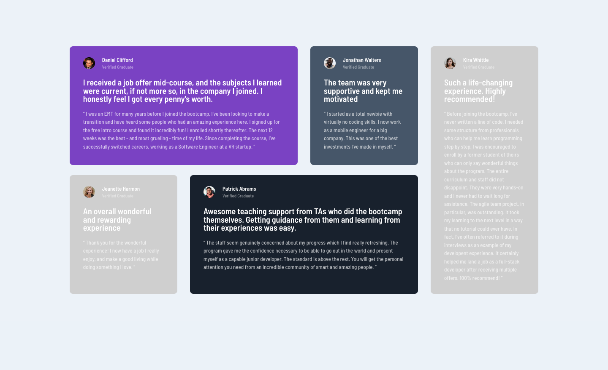
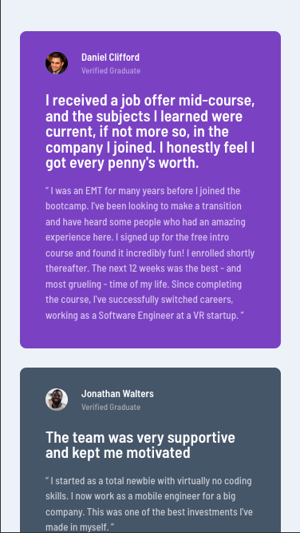

# Frontend Mentor - Testimonials grid section solution

This is a solution to the [Testimonials grid section challenge on Frontend Mentor](https://www.frontendmentor.io/challenges/testimonials-grid-section-Nnw6J7Un7). Frontend Mentor challenges help you improve your coding skills by building realistic projects. 

## Table of contents

- [Overview](#overview)
  - [The challenge](#the-challenge)
  - [Screenshot](#screenshot)
  - [Links](#links)
- [My process](#my-process)
  - [Built with](#built-with)
  - [What I learned](#what-i-learned)
  - [Continued development](#continued-development)
- [Author](#author)

## Overview

### The challenge

Users should be able to:

- View the optimal layout for the site depending on their device's screen size

### Screenshot
**Desktop**

**Mobile**

### Links

- Solution URL: [Source code](https://github.com/ownedbyanonymous/testimonials-grid-section-main)
- Live Site URL: [Live site](https://testimonials-grid-section-main-delta-taupe.vercel.app/)

## My process

### Built with

- Semantic HTML5 markup
- Flexbox
- CSS Grid
- Mobile-first workflow

### What I learned

Tackling this challenge helped reinforce my knowledge of:
- CSS Grid especially the use of grid-template-areas and how to center a grid container both vertically and horizontally.
- The position property with focus on the absolute and relative values.
- Writing good commits using Angular Commit Guidelines

### Continued development

- Writing good commits using the Angular Commit Guidelines
-  Using GitHub copilot 
- Using the CSS position property (absolute and relative values)
- CSS Grid

## Author

- Frontend Mentor - [@ownedbyanonymous](https://www.frontendmentor.io/profile/ownedbyanonymous)
- Twitter - [@ownedbyanonymou](https://www.twitter.com/ownedbyanonymou)
